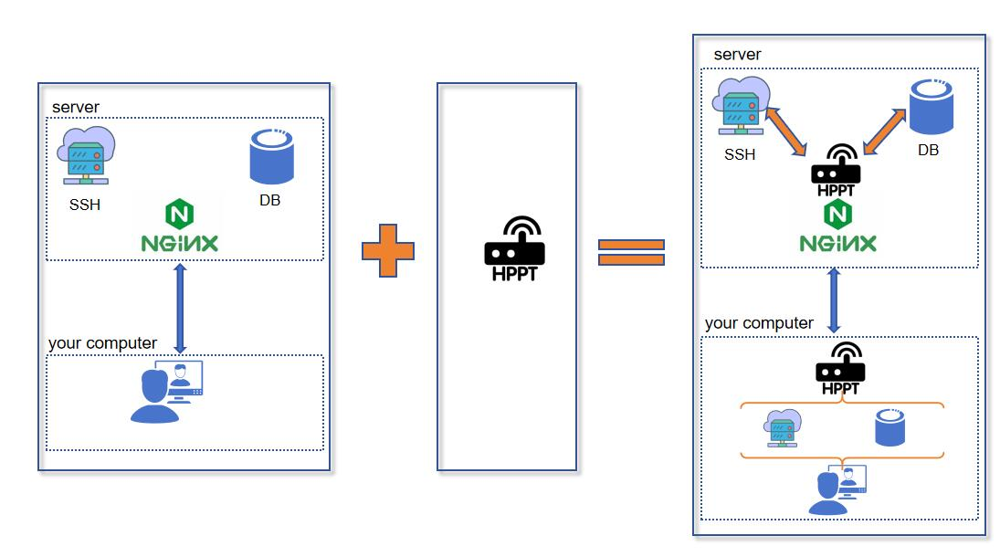
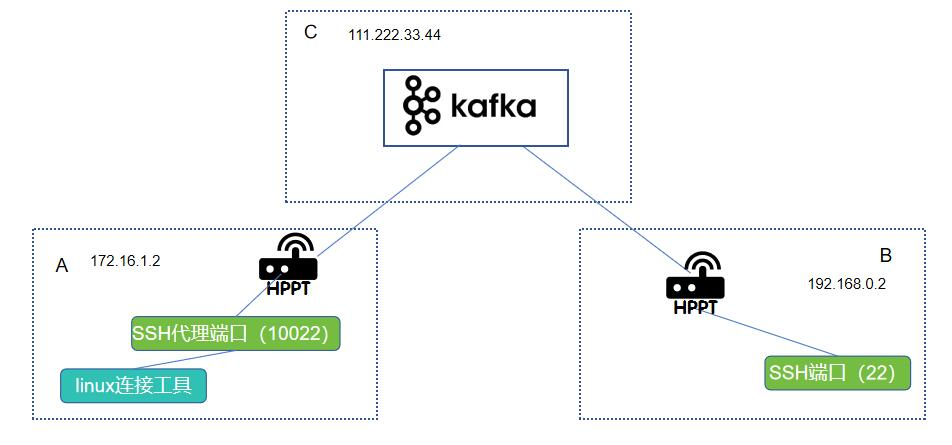

**hppt**, a tool that can forward TCP ports through any protocol.

[中文](./readme.md)&nbsp;&nbsp;&nbsp;&nbsp;[English](./readme_en.md)

[github](https://github.com/codingmiao/hppt)&nbsp;&nbsp;&nbsp;&nbsp;[gitee](https://gitee.com/wowtools/hppt)

# Introduction
In daily work, we often encounter troubles due to the inability to access certain remote ports. For instance, a server's firewall might only allow traffic through ports 80/443 for web access. If you wish to access the database, SSH, or other ports on the server, you can leverage this tool to map the necessary ports:



# Quick Start
Download the latest pre-built `hppt` from the [releases](https://github.com/codingmiao/hppt/releases) page.

Alternatively, build the source code yourself:
```shell
# JAR
mvn clean package -DskipTests

# Optional step to build a native package
su graalvm
cd run
mvn org.graalvm.buildtools:native-maven-plugin:build
```

This project has been compiled into both an executable file and a JAR package.

The executable file has no environment dependencies and consumes less memory, but due to the lack of JIT support, its performance is slightly inferior to running the JAR package.

The JAR package offers better performance but uses more memory. To run the JAR, please download JDK 21 corresponding to your operating system from the [JDK official website](https://jdk.java.net/archive/).

## Example 1: Reverse Proxy Access to Internal Server SSH Port via HTTP Port

Assume you have a server cluster where only one NGINX provides external access through ports 80/443 (111.222.33.44:80), and you want to access the application server (192.168.0.2) on port 22. You can set up the structure as follows:


1. On any server in the cluster, create an `hppt` directory and upload `hppt.jar` (or `hppt.exe` or `hppt_linux_file`), `ss.yml`, and `logback.xml` files:

```
hppt
    - hppt.jar (or hppt.exe or hppt_linux_file)
    - ss.yml
    - logback.xml
```

Adjust the `ss.yml` configuration:

```yaml
# Use the HTTP POST protocol to transmit data. This protocol is the simplest but has slightly worse performance. If needed, check the WebSocket or hppt protocol or define your own protocol.
type: post
# Service HTTP port
port: 20871
# Allowed client accounts and passwords
clients:
  - user: user1
    password: 12345
  - user: user2
    password: 112233
```

(Note 1: For quick demonstration, the type is chosen as the simplest POST type. In this scenario, the best performing protocol is WebSocket, or you can configure the hppt protocol if you have a dedicated port.)

(Note 2: In actual use, to ensure security, it is recommended to make the `password` more complex.)

Run the server-side `hppt` (choose one):

JAR Package Execution
```shell
cd hppt
<jdk21_path>/bin/java -jar hppt.jar ss ss.yml
```

Windows Executable File Execution
```shell
cd hppt
chcp 65001
hppt.exe ss ss.yml
```

Linux Executable File Execution
```shell
cd hppt
./hppt ss ss.yml
# Background execution command: nohup ./hppt ss ss.yml >/dev/null &
```

Add a configuration to NGINX pointing to `hppt`:

```nginx
server {
    # HTTPS is also okay, adjust the NGINX HTTPS configuration accordingly
    listen 80;
    ...
    location /xxx/ {
        proxy_pass http://localhost:20871/;
    }
    ...
```

Afterward, visiting `http://111.222.33.44:80/xxx/` and seeing "error 404" confirms successful server-side deployment.

2. On your laptop, create an `hppt` directory and copy `hppt.jar` (or `hppt.exe` or `hppt_linux_file`), `sc.yml`, and `logback.xml` files:

```
hppt
    - hppt.jar (or hppt.exe or hppt_linux_file)
    - sc.yml
    - logback.xml
```

Adjust the `sc.yml` configuration:

```yaml
# Keep consistent with the server's type
type: post
# Client username, each `sc` process should use a unique one, do not repeat
clientUser: user1
# Client password
clientPassword: 12345

post:
  # Server HTTP address, if direct connection is not possible, use NGINX proxy several times, fill in the NGINX address
  serverUrl: "http://111.222.33.44:80/xxx"
  # Without NGINX, directly configure the original server port
  # serverUrl: "http://111.222.33.44:20871"
  # Artificially set delay (milliseconds), usually 0, if transferring files or large amounts of data with low latency requirements, set a delay of a few hundred milliseconds to reduce the frequency of POST requests
  sendSleepTime: 0
forwards:
    # Map the 22 port of 192.168.0.2 to the local machine's port 10022
  - localPort: 10022
    remoteHost: "192.168.0.2"
    remotePort: 22
    # Similarly, you can proxy any TCP port, as long as the server where `hppt` is located can access the port
  - localPort: 10023
    remoteHost: "192.168.0.3"
    remotePort: 3306
```

Start the client-side `hppt` (choose one):

JAR Package Execution
```shell
cd hppt
<jdk21_path>/bin/java -jar hppt.jar sc sc.yml
```

Windows Executable File Execution
```shell
cd hppt
chcp 65001
hppt.exe sc sc.yml
```

Linux Executable File Execution
```shell
cd hppt
./hppt sc sc.yml
# Background execution command: nohup ./hppt ss ss.yml >/dev/null &
```

Afterward, you can use a Linux connection tool to access the application server via localhost's port 10022 at your company.

## Example 2: Network Penetration via Public Network Relay to Access Servers Without Public IP Addresses

Assume you have a desktop computer at home (SSH port 22) and a public VPS server (IP 111.222.33.44), and you want to access the desktop from your company's laptop. You can set up the structure as follows:


1. On the public server, create an `hppt` directory and copy `hppt.jar` (or `hppt.exe` or `hppt_linux_file`), `sc.yml`, and `logback.xml` files:

```
hppt
    - hppt.jar (or hppt.exe or hppt_linux_file)
    - sc.yml
    - logback.xml
```

Adjust the `sc.yml` configuration:

```yaml
# Communication protocol. This example uses the highest-performing hppt protocol, prefixed with 'r' to indicate the role swap between client and server. You can also configure HTTP POST or WebSocket here.
type: rhppt
# Client username, each `sc` process should use a unique one, do not repeat
clientUser: user1
# Client password
clientPassword: 12345

# Service port
rhppt:
  port: 20871

forwards:
    # Map the 22 port of 192.168.0.2 to the local machine's port 10022
  - localPort: 10022
    remoteHost: "192.168.0.2"
    remotePort: 22
    # Similarly, you can proxy any TCP port, as long as the server where `hppt` is located can access the port
  - localPort: 10023
    remoteHost: "192.168.0.3"
    remotePort: 3306
```

Start the `hppt` on the public server (choose one):

JAR Package Execution
```shell
cd hppt
<jdk21_path>/bin/java -jar hppt.jar sc sc.yml
```

Windows Executable File Execution
```shell
cd hppt
chcp 65001
title "hppt"
hppt.exe sc sc.yml
pause
```

Linux Executable File Execution
```shell
cd hppt
./hppt sc sc.yml
# Background execution command: nohup ./hppt ss ss.yml >/dev/null &
```

2. On your home desktop, create an `hppt` directory and copy `hppt.jar` (or `hppt.exe` or `hppt_linux_file`), `ss.yml`, and `logback.xml` files:

```
hppt
    - hppt.jar (or hppt.exe or hppt_linux_file)
    - ss.yml
    - logback.xml
```

Adjust the `ss.yml` configuration:

```yaml
# Communication protocol, keep consistent with the client
type: rhppt
# Service HTTP port
port: 20871

# Point to the service started in the previous step's IP and port
rhppt:
  host: "111.222.33.44"
  port: 20871

# Allowed client accounts and passwords
clients:
  - user: user1
    password: 12345
  - user: user2
    password: 112233
```

Start `hppt` on the home desktop (choose one):

JAR Package Execution
```shell
cd hppt
<jdk21_path>/bin/java -jar hppt.jar ss ss.yml
```

Windows Executable File Execution
```shell
cd hppt
chcp 65001
title "hppt"
hppt.exe ss ss.yml
pause
```

Linux Executable File Execution
```shell
cd hppt
./hppt ss ss.yml
# Background execution command: nohup ./hppt ss ss.yml >/dev/null &
```

Afterward, you can use a Linux connection tool to access the home desktop via 111.222.33.44's port 10022 from your company.

## Example 3: Writing a Custom Protocol
As shown in the diagram, machines A and B cannot communicate directly, but they can both access Kafka on machine C. This example demonstrates how to write a custom protocol to enable machine A to use Kafka on C as a bridge to access the SSH port on B:



First, clone this project locally, then run `mvn clean install` to install the project in Maven.

Then, create a Java project and add the hppt-run and Kafka Maven dependencies:
```xml
<dependency>
    <groupId>org.wowtools.hppt</groupId>
    <artifactId>run</artifactId>
    <version>1.0-SNAPSHOT</version>
</dependency>
<!-- Continue adding other dependencies -->
```

Then you can start writing the code:

Write a server implementation and run it on machine B, implementing the following methods:
```java
public class ServerDemo extends ServerSessionService<T> {

    public ServerDemo(SsConfig ssConfig) {
        super(ssConfig);
    }

    // What needs to be done during initialization
    public void init(SsConfig ssConfig) throws Exception {
    }

    // How to send bytes to the client
    protected void sendBytesToClient(T ctx, byte[] bytes) {
    }

    // When receiving bytes from the client, call receiveClientBytes(CTX ctx, byte[] bytes) proactively

    // What needs to be done when the client disconnects
    protected void closeCtx(T ctx) throws Exception {
    }

    // When this server closes, release resources like connection pools here
    protected void doClose() throws Exception {
    }
}
```
For a complete example implementation, see [here](kafkademo/src/main/java/org/wowtools/hppt/kafkademo/ServerDemo.java).

Write a client implementation and run it on machine B, implementing the following methods:
```java
public class ClientDemo extends ClientSessionService {
    public ClientDemo(ScConfig config) throws Exception {
        super(config);
    }

    // How to connect to the server
    protected void connectToServer(ScConfig config, Cb cb) throws Exception {
    }

    // How to send bytes to the server
    protected void sendBytesToServer(byte[] bytes) {
    }

    // When receiving bytes from the server, call receiveServerBytes(byte[] bytes) proactively
}
```
For a complete example implementation, see [here](kafkademo/src/main/java/org/wowtools/hppt/kafkademo/ClientDemo.java).

Subsequently, you can access the SSH port 22 on B via A's port 10022.

# Q&A

## Performance?
Using protocols like `hppt` or WebSocket, this project merely performs forwarding and encryption/decryption operations, resulting in performance loss of less than 5%. Here's a comparison of the time taken to copy a 186 MB file using `scp` command, connecting directly versus through a proxy:

```shell
# Direct Connection
scp -P 22 jdk-21_linux-aarch64_bin.tar.gz   root@xxx:/xxx
100%  186MB   7.5MB/s   00:25
# Through Proxy
scp -P 10022 jdk-21_linux-aarch64_bin.tar.gz   root@xxx:/xxx
100%  186MB   7.2MB/s   00:26
```

However, if using the HTTP POST protocol, there is a significant performance overhead due to the short-lived nature of HTTP connections and the inclusion of many unnecessary headers. In my application environment tests, the performance loss was around 30% in some cases. Therefore, in performance-sensitive scenarios, it is recommended to use long-lived connection protocols, and short-lived connection protocols should only be used when performance is not a concern or the environment does not permit their use.

## Security?
Only specified users can connect, and data transmission is encrypted to prevent eavesdropping. If you require more personalized authentication, such as user login, you can contact [liuyu@wowtools.org](mailto:liuyu@wowtools.org) for customized development.

# Future Plans
- Complete the `rwebsocket` protocol and optimize the `rpost` protocol's performance overhead.
- Develop relay mode.
- Improve documentation and examples.
- ... (If you have any fun ideas, please submit an issue or email us.)
